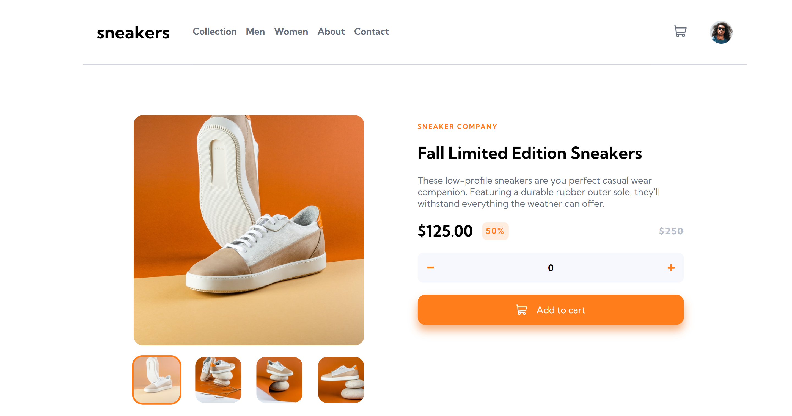

# Frontend Mentor - E-commerce product page solution

This is a solution to the [E-commerce product page challenge on Frontend Mentor](https://www.frontendmentor.io/challenges/ecommerce-product-page-UPsZ9MJp6). Frontend Mentor challenges help you improve your coding skills by building realistic projects.

## Table of contents

- [Overview](#overview)
  - [The challenge](#the-challenge)
  - [Screenshot](#screenshot)
  - [Links](#links)
  - [Built with](#built-with)
  - [Useful resources](#useful-resources)
  - [Author](#author)

## Overview

### The challenge

Users should be able to:

- View the optimal layout for the site depending on their device's screen size
- See hover states for all interactive elements on the page
- Open a lightbox gallery by clicking on the large product image
- Switch the large product image by clicking on the small thumbnail images
- Add items to the cart
- View the cart and remove items from it

### Screenshot

### Links

- Solution URL: [GitHub](https://github.com/BarrosLucasJavier/ecommerceFM)
- Live Site URL: [Deploy](https://ecommerce-fm-woad.vercel.app/)

### Built with

- Semantic HTML5 markup
- CSS custom properties
- Flexbox
- Mobile-first workflow
- [React](https://reactjs.org/) - JS library
- [Vite](https://vitejs.dev/)

### Useful resources

- [Refuerzo de conceptos](https://developer.mozilla.org/en-US/) - Me ayudo con la estructura de ciertas propiedades de css

## Author

- GitHub - [Barros Lucas Javier](https://github.com/BarrosLucasJavier)
- Frontend Mentor - [@BarrosLucasJavier](https://www.frontendmentor.io/profile/BarrosLucasJavier)